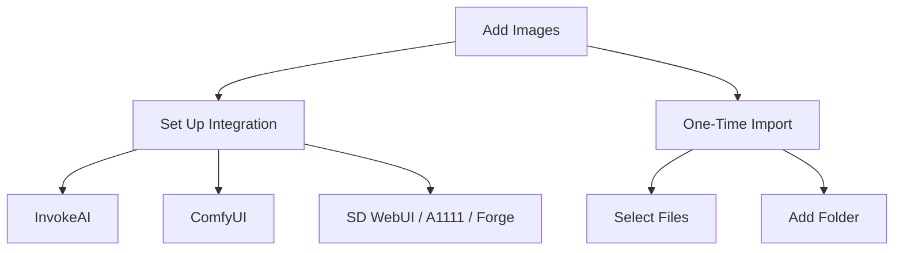

# Adding Folders

[Back to manual index](index.md)

Ambit builds its library by scanning local image folders and selected files. It catalogs supported image files, parses generation metadata when available, and keeps the original files on disk.

## Import Choices

When Ambit asks you to add images, you can choose between integration setup and one-time import.

Use integrations when you want Ambit to understand an existing generator workspace. Use one-time import for downloaded packs, screenshots, archives, or individual files.

## Monitored Image Folders

Open Settings, then Connections, then Folders to manage image folders.

In the Folders section you can:

- add folders containing AI-generated images
- review folders Ambit is monitoring
- rescan a single folder
- refresh metadata across all folders
- remove a folder from Ambit's monitored list

Adding a folder catalogs the files. It does not move or delete your source files.

## Generator Integrations

Ambit has connection pages for common local generator tools:

- InvokeAI: select the root folder containing `databases/invokeai.db`, then test the connection.
- ComfyUI: select the output folder where ComfyUI saves generated images, then link it.
- SD WebUI: select an installation or archive path, scan for output folders, choose folders, then link and import them.

For SD WebUI style folders, Ambit can auto-detect variants such as A1111, Forge, SD.Next, and Anapnoe. If auto-detection is uncertain, select the installation type manually before scanning.

## Resource Folders

Settings, Connections, Folders also includes resource discovery. Use this for model, LoRA, embedding, ControlNet, or IP-Adapter folders. Resource folders help Ambit build a local asset inventory, which can make resource filters more useful.

## During Scans

Scans can take time on large folders. Ambit reports progress while it scans sources, imports images, and finalizes metadata. If an import is cancelled, imported images are kept and unfinished folders can be rescanned later.

## Next Step

After images appear, continue with [Browsing The Library](browsing-library.md).
