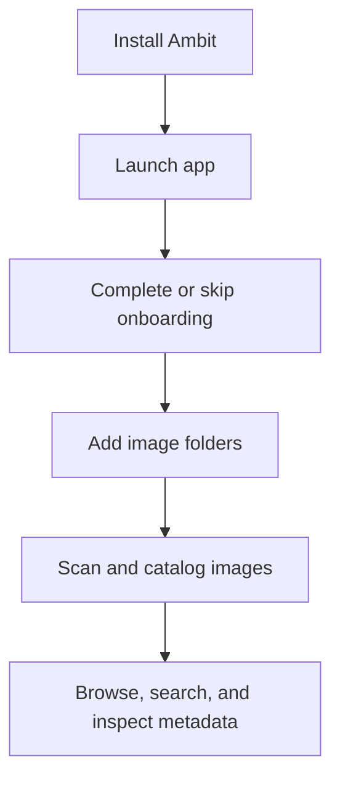

# Getting Started

[Back to manual index](index.md)

Ambit is a local-first desktop app for organizing large AI-generated image libraries. The public beta is currently distributed as Windows builds through GitHub Releases.

## Install The Public Beta

1. Open the Ambit [GitHub Releases](https://github.com/AsuraAce/ambit/releases) page.
2. Download the Windows setup installer ending in `-setup.exe`.
3. Run the installer and launch Ambit.

You do not need Node.js, pnpm, Rust, Tauri, or VS Code unless you want to build Ambit from source.

## First Launch

On first launch, Ambit shows an onboarding wizard. The wizard introduces:

- integrations for InvokeAI, ComfyUI, and SD WebUI style output folders
- optional Gemini-powered intelligence features
- local-first privacy behavior
- content masking for prompts containing configured keywords

You can skip optional integrations during onboarding and set them up later from Settings.

## Main Areas

The main Ambit workspace has a left sidebar, a library area, and an optional filter panel.

- Grid View shows image thumbnails for everyday browsing.
- Timeline View groups browsing around image time.
- Statistics shows library-level summaries.
- Maintenance helps resolve missing files, duplicates, removed items, and other cleanup tasks.
- Filters opens the library filter panel.
- Settings opens preferences and integrations.
- Help opens keyboard shortcuts and search syntax.

## What Ambit Stores

Ambit keeps source image files where they already are. It stores a local catalog, metadata, thumbnails, settings, and optional integration configuration so the app can search and maintain the library quickly.

On Windows, the installer folder is only where the Ambit application is installed. The library catalog database is application data and lives under Local AppData, normally `%LOCALAPPDATA%\io.github.asuraace.ambit\images.db`. Installing Ambit to another folder or drive does not move the library database.

Sensitive values such as a Gemini API key are stored locally through the OS keyring path Ambit uses rather than being required in the repository or source code.

## Next Step

After first launch, continue with [Adding Folders](adding-folders.md).
