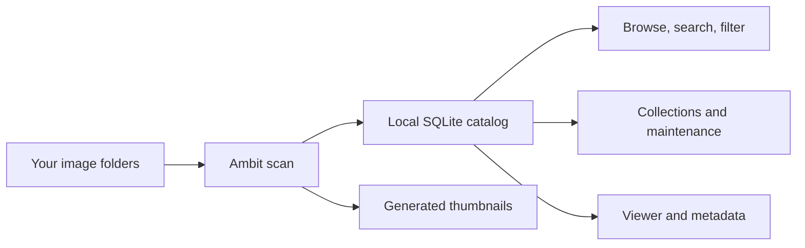

# Ambit User Manual

This manual is for people using Ambit public beta builds. It explains how to install Ambit, add image folders, browse and search a library, inspect metadata, organize images, and recover from common library problems.

Ambit is currently a public beta. Official public beta builds are Windows-only while macOS and Linux support is being validated.

## How Ambit Works

Ambit catalogs local image folders. It does not need to move your original image files into a managed library folder.

The core app is local-first. Image records, metadata, thumbnails, and settings are stored on your machine. Optional network features are documented in [Settings And Privacy](settings-and-privacy.md).

## Manual Pages

- [Getting Started](getting-started.md): install the public beta, launch Ambit, and complete the first-run wizard.
- [Adding Folders](adding-folders.md): add monitored image folders and run one-time imports.
- [Generator Integrations](generator-integrations.md): connect InvokeAI, ComfyUI, SD WebUI, A1111, Forge, SD.Next, and Anapnoe output locations.
- [Browsing The Library](browsing-library.md): use grid, timeline, statistics, selection, favorites, pins, and the viewer.
- [Search, Filters, And Collections](search-filters-collections.md): search prompts and metadata, use facets, and organize images.
- [Assets And Resource Discovery](assets-resource-discovery.md): understand used assets, local disk inventory, resource folders, and Assets tab scopes.
- [Viewer And Metadata](viewer-and-metadata.md): inspect prompts, resources, workflow data, notes, and image versions.
- [Maintenance](maintenance.md): resolve missing files, thumbnail optimization, duplicates, removed items, untagged records, and intermediates.
- [Settings And Privacy](settings-and-privacy.md): understand folders, privacy controls, AI features, update checks, and network behavior.
- [Troubleshooting](troubleshooting.md): diagnose common first-run, scan, metadata, thumbnail, and privacy issues.

## Related Project Docs

This manual is user-facing. For development setup and pull request expectations, see [Contributing To Ambit](../../CONTRIBUTING.md). For security-sensitive reports, follow [Security Policy](../../SECURITY.md) instead of opening a public issue.
