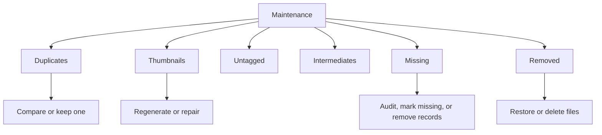

# Maintenance

[Back to manual index](index.md)

Maintenance helps keep Ambit's catalog aligned with your local files and metadata. Open Maintenance from the left sidebar.

## Library Record vs Source File

Most Maintenance actions change Ambit's local catalog, not your original image files. Use this distinction before choosing a cleanup action:

| Action | What it changes | Source files |
| --- | --- | --- |
| File Link Audit, Re-Scan Files, Repair Broken Thumbnails | Checks or repairs Ambit's local records and thumbnail references | Not touched |
| Prune All Records | Accepts audited missing paths as missing in Ambit's catalog | Not touched and not recovered |
| Remove from Library, Remove all from Library, duplicate resolution | Removes records from the active library; removed records can appear in Removed when Ambit has enough record data | Kept on disk |
| Restore to Library | Moves selected Removed records back into the active library | Not touched |
| Delete File in Removed | Destructive path for selected Removed records; moves source files to OS trash when possible | Moved to OS trash when the action succeeds |

If you are unsure, prefer scans, repairs, rescans, and restore actions before actions that remove records or delete files.

## Maintenance Areas

Ambit currently exposes these maintenance tabs:

- Missing: audit file links, mark missing paths, and remove records whose source files are gone.
- Thumbnails: regenerate unoptimized thumbnails, repair broken thumbnail references, and clean up unused thumbnails.
- Duplicates: scan the full library for exact SHA-256 content matches, compare copies, and remove redundant records.
- Untagged: review records with missing or incomplete metadata.
- Intermediates: review images flagged as intermediates when the tab is visible, move keepers back to the gallery, or delete unwanted files.
- Removed: restore removed records or delete selected source files from disk.

## Missing

The Missing tab helps when files were moved, renamed, deleted outside Ambit, or live on a disconnected drive.

Use File Link Audit to check whether active library records still point to files on disk. After an audit has run, Re-Scan Files runs the check again. If missing paths appear, review the sample paths first; a disconnected drive or renamed folder can make many healthy records look missing.

Use Prune All Records only when you want Ambit to accept the audited paths as missing. This updates Ambit's catalog state. It does not restore files, search other folders for replacements, or delete source files.

After records appear in Missing, select records and use Remove from Library, or use Remove all from Library when every listed record should leave the active library. These actions clean Ambit's active catalog for files that are already unavailable; they do not recover files.

## Thumbnails

The Thumbnails tab finds images that could benefit from thumbnail regeneration. Before the tab is loaded, choose Current Filter or Global when starting the maintenance scan. Once results are visible, use Library or Filtered View to control the regeneration scope.

Use the thumbnail controls this way:

- Include upgradeable: include thumbnails that already exist but can be replaced with higher-quality versions.
- Regenerate Selected: rebuild thumbnails for selected records.
- Regenerate All Unoptimized: rebuild all unoptimized thumbnails in the chosen scope in batches.
- Repair Broken Thumbnails: check thumbnail files on disk and reset missing thumbnail references.
- Clean up unused thumbnails: remove unused thumbnail files when the selected scope is already optimized.

Ambit can also heal thumbnails in the background during normal use. If Smart Thumbnail Optimization is running, manual thumbnail controls may be disabled until background work finishes.

## Duplicates

The Duplicates tab scans the entire library for byte-for-byte matches using SHA-256 content hashes. File size is used only to avoid hashing files that cannot be duplicates; matching size, dimensions, or metadata alone does not create a duplicate group.

Use duplicate actions this way:

- Compare: inspect two copies side by side when available.
- Keep Only This: keep the selected copy, merge safe library state, and move the other records to Removed.
- Keep Latest Modified or Keep Earliest Modified: bulk-resolve every exact group using filesystem modification time.
- Rescan: rerun global exact-duplicate detection. A cancelled or partially failed scan is shown as incomplete rather than clean.

The keeper inherits favorite and pinned state plus manual collection memberships from the removed copies. Its own metadata, notes, and board remain unchanged. Its explicit manual mask setting wins; an automatic setting inherits an override only when the removed copies agree. Duplicate resolution keeps source files on disk. To delete files later, review the Removed tab and use Delete File intentionally.

## Untagged

Untagged helps find images without descriptive metadata or positive prompts. Use Global to scan the whole library, or Filtered to inspect only the current filter result set.

Use View Image to inspect a record before cleanup. Use Remove from Library only when the selected records should leave Ambit's active library while keeping their source files on disk.

## Intermediates

The Intermediates tab appears only when Ambit has images flagged as intermediate outputs, such as images without the expected InvokeAI metadata. Use Global or Filtered scope to control which intermediate records you review.

Use View Image to inspect a record before cleanup. Use Move to Gallery when an image is a keeper and should stop being treated as an intermediate. For intentional source-file deletion, first remove the record from the active library, then review it in Removed and use Delete File.

## Removed

Removed contains images that were removed from the active library while kept on disk. Select records to choose between:

- Restore to Library: restore selected records to the active library.
- Delete File: move selected source files to OS trash when possible, then remove those records from Ambit.

Treat Delete File carefully. If moving a file to OS trash fails, Ambit reports the failure instead of silently completing the deletion.

## Thumbnail Problems

Ambit performs thumbnail handling in the background. If thumbnails are stale or broken, start with Maintenance > Thumbnails:

- Repair Broken Thumbnails checks thumbnail files on disk and resets missing thumbnail references.
- Regenerate Selected rebuilds thumbnails for selected records.
- Regenerate All Unoptimized repairs the chosen scope in batches.

Settings > Advanced > Support includes an Open Maintenance shortcut for these repair tools.

## Metadata Refresh

From Settings > Connections > Folders, use Refresh All Metadata or a folder-level refresh when metadata filters look stale after external changes.

## Start Over

Maintenance is for repairing and cleaning selected library records. To reset Ambit's catalog and linked folders, use Settings > Advanced > Database > Purge Database. Purge Database resets imported metadata and app state, but source image files are not touched.

## Next Step

For settings and network behavior, continue with [Settings And Privacy](settings-and-privacy.md).
