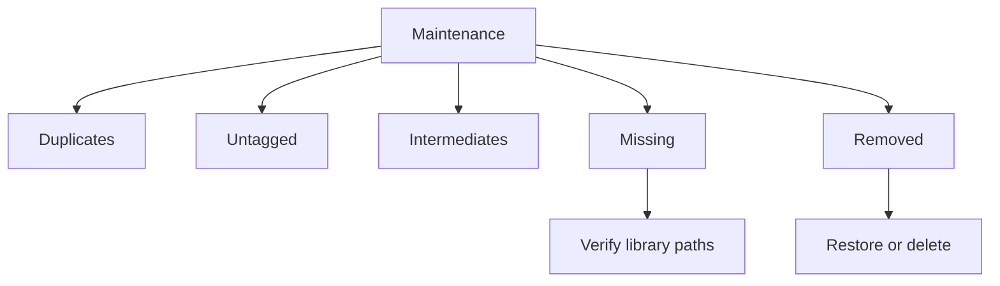

# Maintenance

[Back to manual index](index.md)

Maintenance helps keep Ambit's catalog aligned with your local files and metadata. Open Maintenance from the left sidebar.

## Maintenance Areas

Ambit currently exposes these maintenance tabs:

- Duplicates: find and resolve duplicate candidates.
- Untagged: review records with missing or incomplete metadata.
- Intermediates: review images flagged as intermediates when the tab is visible.
- Missing: find catalog records whose source files are missing.
- Removed: restore removed records or permanently delete files when that action is chosen.

## Duplicates

The Duplicates tab scans for likely duplicate images. Duplicate cleanup is conservative: resolving duplicates removes redundant records from Ambit's library or Removed flow by default rather than deleting original files automatically.

Use Compare when available to inspect candidates before resolving them.

## Missing

The Missing tab helps when files were moved, renamed, deleted outside Ambit, or live on a disconnected drive.

Use the library health scan to check file availability. For missing records you can remove the record from Ambit's library. This cleans the catalog entry; it does not recover a file that no longer exists on disk.

## Removed

Removed contains images that were removed from the active library. You can restore selected records or choose a delete action when you intentionally want to delete files.

Treat destructive delete actions carefully. Ambit separates library removal from file deletion so cleanup does not have to destroy source images.

## Untagged And Intermediates

Untagged helps find images without useful parsed metadata. Intermediates appears when Ambit has images flagged as intermediate outputs, such as images without the expected InvokeAI metadata.

Use these tabs to remove, review, or unmark records depending on what the tab offers.

## Thumbnail Problems

Ambit performs thumbnail handling in the background. If thumbnails are stale or broken, use Settings, Advanced, Troubleshooting:

- Verify Files checks thumbnail paths and resets missing thumbnail references.
- Reset All clears thumbnail references so Ambit can rediscover or regenerate thumbnails.
- Verify Library checks source files and thumbnails together.

## Metadata Refresh

From Settings, Connections, Folders, use Refresh All Metadata or a folder-level refresh when metadata filters look stale after external changes.

## Next Step

For settings and network behavior, continue with [Settings And Privacy](settings-and-privacy.md).
