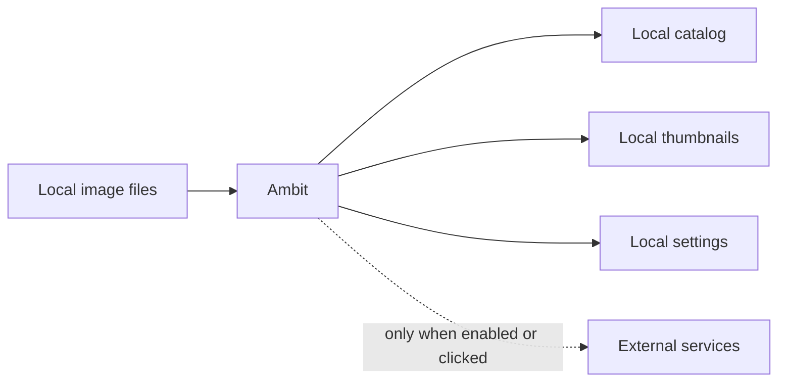

# Settings And Privacy

[Back to manual index](index.md)

Settings controls Ambit's app preferences, integrations, privacy behavior, optional intelligence features, and advanced maintenance tools.

## Settings Sections

The Settings window contains:

- General: app-level preferences.
- Connections: folders, Resources, InvokeAI, SD WebUI, and ComfyUI setup.
- Intelligence: optional AI features and model/prompt configuration.
- Privacy: content masking behavior and masked keywords.
- Advanced: database, interface, update, and troubleshooting tools.
- Dev Tools: development-only tools when enabled.

For image generator setup details, see [Generator Integrations](generator-integrations.md). For model and resource folder setup, see [Assets And Resource Discovery](assets-resource-discovery.md).

## Local-First Behavior

Ambit's core library management works locally. Browsing, search, metadata parsing, thumbnails, maintenance, and settings do not require telemetry.

## Network Behavior

The public beta has a small set of disclosed network paths:

- Automatic update checks contact GitHub Releases when enabled. Updates install only after you confirm the prompt.
- Gemini features are optional and use your own key. Requests are sent only when you verify a key or run an AI action.
- CivitAI model-hash resolution is optional. It runs only after you confirm Resolve Online and sends unresolved model hash strings, not image files.
- GitHub Sponsors, Ko-fi, repository, and project links open only when clicked.

## Privacy Controls

Open Settings, then Privacy to configure content masking.

You can choose:

- Prompt keyword masking: automatically apply the current masking behavior to prompts containing saved keywords. This preference persists across restarts.
- Blur Content: keep matching images visible but blurred.
- Hide Completely: hide matching images from normal browsing.

Masked keywords are matched against prompts only while Prompt keyword masking is enabled. You can continue to view and edit the saved list while it is disabled.

Turning Prompt keyword masking off in Settings or onboarding retains the complete custom keyword list. Restarting Ambit or onboarding keeps both the switch state and saved list. Re-enabling uses that same list; if the list is empty, no prompts match until you add a keyword. Purge Database is a factory reset and restores Prompt keyword masking with Ambit's default keywords and Blur Content behavior.

Prompt keyword masking is separate from the session Privacy Mode switch. Privacy Mode starts enabled each time Ambit launches and also controls explicit manual image masks. Turning automatic prompt matching off does not remove those manual masks.

## Intelligence Features

Intelligence features are off unless configured. When enabled, Ambit can use Gemini for tasks such as prompt analysis or variation ideas. These actions are on-demand and depend on your own Gemini API key.

Create or view a key in [Google AI Studio](https://aistudio.google.com/apikey). A free tier is available for eligible accounts and regions, with model and usage limits. Keys entered through Ambit are stored in the OS keyring; credentials supplied through the environment are read but not saved by Ambit. Images or prompts are sent to Google only when you verify the key or run a Gemini feature, and Google handles those requests under the terms of your AI Studio plan.

A securely stored key is shown as **API key configured** when you return to onboarding or Settings. **API key verified and saved** confirms a successful verification in the current session; it does not guarantee that Google will continue accepting the key indefinitely.

If an AI action fails, confirm that the key is saved, the key verifies successfully, and the network is available.

## Advanced Tools

Advanced includes:

- backup settings
- automatic update controls
- Restart onboarding, which closes Settings and immediately opens a fresh wizard at Step 1
- support diagnostics, including the active library database and app log locations
- database reset tools

The database location shown in Support Diagnostics is the local catalog path, not the Ambit installer path. On Windows, Ambit stores the catalog under Local AppData and may show a legacy Roaming AppData fallback only for older installs that could not be moved automatically.

Support Diagnostics also shows the app log file location. Use Show Logs Folder or Copy Diagnostics when collecting details for an issue; the copied diagnostics include paths and aggregate counts, not image prompts or metadata.

Use Purge Database only when you intentionally want to remove all imported metadata and reset application state. The confirmation explains that source image files are not touched, but Ambit's catalog and linked folders are reset.

## Next Step

For common fixes, continue with [Troubleshooting](troubleshooting.md).
