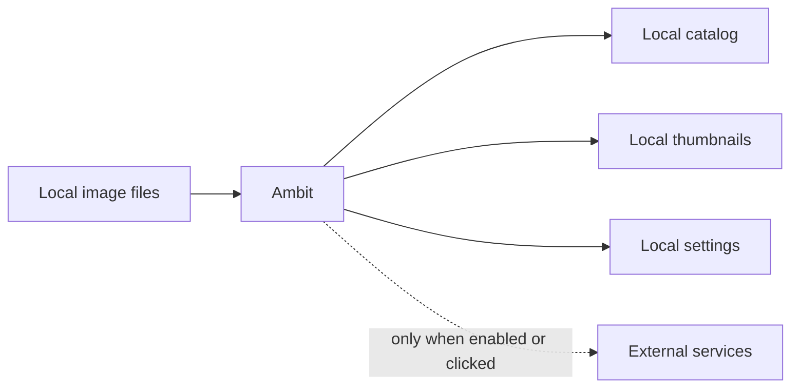

# Settings And Privacy

[Back to manual index](index.md)

Settings controls Ambit's app preferences, integrations, privacy behavior, optional intelligence features, and advanced maintenance tools.

## Settings Sections

The Settings window contains:

- General: app-level preferences.
- Connections: folders, Resources, InvokeAI, SD WebUI, and ComfyUI setup.
- Intelligence: optional AI features and model/prompt configuration.
- Privacy: content masking behavior and masked keywords.
- Advanced: database, interface, update, and troubleshooting tools.
- Dev Tools: development-only tools when enabled.

For image generator setup details, see [Generator Integrations](generator-integrations.md). For model and resource folder setup, see [Assets And Resource Discovery](assets-resource-discovery.md).

## Local-First Behavior

Ambit's core library management works locally. Browsing, search, metadata parsing, thumbnails, maintenance, and settings do not require telemetry.

## Network Behavior

The public beta has a small set of disclosed network paths:

- Automatic update checks contact GitHub Releases when enabled. Updates install only after you confirm the prompt.
- Gemini features are optional and use your own key. Requests are sent only when you verify a key or run an AI action.
- CivitAI model-hash resolution is optional. It runs only after you confirm Resolve Online and sends unresolved model hash strings, not image files.
- GitHub Sponsors, Ko-fi, repository, and project links open only when clicked.

## Privacy Controls

Open Settings, then Privacy to configure content masking.

You can choose:

- Blur Content: keep matching images visible but blurred.
- Hide Completely: hide matching images from normal browsing.

Masked keywords are matched against prompts. Add only terms you actually want Ambit to use for local masking decisions.

## Intelligence Features

Intelligence features are off unless configured. When enabled, Ambit can use Gemini for tasks such as prompt analysis or variation ideas. These actions are on-demand and depend on your own Gemini API key.

If an AI action fails, confirm that the key is saved, the key verifies successfully, and the network is available.

## Advanced Tools

Advanced includes:

- backup settings
- automatic update controls
- reset onboarding
- support diagnostics, including the active library database location
- database reset tools

The database location shown in Support Diagnostics is the local catalog path, not the Ambit installer path. On Windows, Ambit stores the catalog under Local AppData and may show a legacy Roaming AppData fallback only for older installs that could not be moved automatically.

Use Purge Database only when you intentionally want to remove all imported metadata and reset application state. The confirmation explains that source image files are not touched, but Ambit's catalog and linked folders are reset.

## Next Step

For common fixes, continue with [Troubleshooting](troubleshooting.md).
