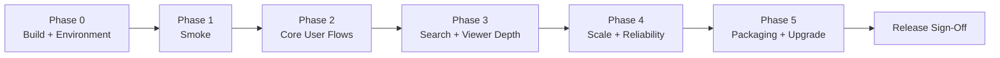
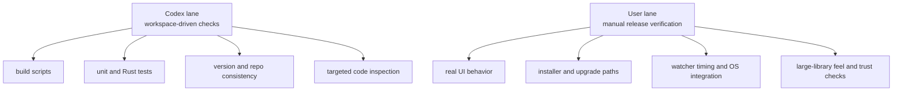

# Release Test Checklist

Status: Working draft
Last updated: 2026-04-30

Use this checklist for staged release testing of Ambit. It is scoped to the current app shape:

- Tauri desktop shell with Rust commands
- React/TypeScript frontend
- SQLite-backed image library and metadata
- `library.json` settings persistence
- local filesystem folder sync, watcher, thumbnails, search, and viewer flows
- optional Gemini-backed intelligence features

## Test Flow

## How To Use This

- Run phases in order. Do not spend time on deep feature checks until smoke passes.
- Record OS, build type, app version, test library size, and whether the run used a fresh or existing profile.
- For every failure, note: expected result, actual result, repro steps, and whether it blocks release.
- Mark each item `Pass`, `Fail`, `N/A`, or `Deferred`.

## Ownership Split

Use two lanes so we do not both spend time on the same check.

### Codex Lane

I should own checks that can be run or inspected directly in the workspace:

- build and packaging commands
- frontend and Rust automated tests
- version consistency checks
- code review of risky release paths
- log and failure triage when a command breaks
- turning findings into concrete follow-up issues or fixes

### User Lane

You should own checks that require judgment, live desktop interaction, or a real install environment:

- whether the app feels responsive and coherent in the UI
- whether search results, counts, and metadata look correct on your real libraries
- whether viewer navigation, compare mode, and timeline behavior feel right
- whether watcher behavior matches your expectation during live file changes
- whether installer, upgrade, uninstall, and persisted state behave correctly on your machine
- whether a release candidate feels trustworthy enough to ship

### Shared Lane

Some checks are best split:

- I run the command or prepare the candidate build.
- You verify the visible behavior in the app.
- I investigate and fix anything that fails.

## Test Matrix

Capture one line per run:

| Run | OS | Build | Dataset | Profile | Result |
| --- | --- | --- | --- | --- | --- |
| 1 |  | dev / packaged | small / medium / large | fresh / existing |  |
| 2 |  | dev / packaged | small / medium / large | fresh / existing |  |
| 3 |  | dev / packaged | small / medium / large | fresh / existing |  |

## Phase 0: Build And Environment Gate

Goal: confirm the branch is shippable before manual QA starts.

Owner: Codex first, then user only if a packaged artifact behaves differently on the target machine.

- [ ] `pnpm run build` completes successfully.
- [ ] `pnpm run test` passes for the current branch or any failures are known and documented.
- [ ] `pnpm run test:rust` passes or any failures are known and documented.
- [ ] `pnpm run check:versions` passes before packaging.
- [ ] Packaged app can be produced with `pnpm run app:build`.
- [ ] Release notes/version numbers are consistent across package metadata and Tauri config.
- [ ] No accidental debug artifacts, local secrets, or scratch files are included in the build.

## Phase 1: Smoke Test

Goal: catch immediate release blockers in under 15 minutes.

Owner: Shared. I can prepare the build and review logs; you should verify the visible desktop behavior.

- [ ] App launches cleanly from a packaged build.
- [ ] Existing library opens without crash, long stall, or blank screen.
- [ ] Fresh profile can complete first-run setup.
- [ ] Settings modal opens and closes cleanly.
- [ ] At least one watched folder can be added successfully.
- [ ] Initial scan/import completes and images appear in the library.
- [ ] A basic search returns expected images.
- [ ] Opening an image in the viewer works.
- [ ] Closing the app and reopening preserves the expected library/settings state.

Exit criteria:

- No crash on launch, scan, search, viewer open, or restart.
- No corruption of settings, folders, or library records.

## Phase 2: Core User Workflows

Goal: validate the main product loop for local image management.

Owner: Mostly user. I can support with targeted data setup, code inspection, and bug-fix follow-through.

### Library Setup And Persistence

- [ ] Add one valid library folder.
- [ ] Add multiple folders and verify they persist after restart.
- [ ] Reject or safely handle an invalid, missing, or inaccessible folder.
- [ ] Removing a folder does not corrupt the remaining library.
- [ ] App handles rescanning an already-known folder cleanly.
- [ ] Folder sync or watcher state survives restart as expected.

### Import, Scan, And Metadata

- [ ] PNGs with expected metadata parse correctly.
- [ ] Images with weak or partial metadata do not crash import.
- [ ] Non-image files in library folders are ignored safely.
- [ ] Duplicate or repeat scans do not create obvious duplicate records unless intended.
- [ ] Thumbnail generation completes for newly imported files.
- [ ] Metadata-heavy images still appear and remain viewable.
- [ ] ComfyUI or workflow-style metadata can be opened where available.

### Settings And Local-First Behavior

- [ ] Settings changes persist after restart.
- [ ] Sensitive keys are not written into plain JSON settings.
- [ ] Disabling optional intelligence features leaves the rest of the app functional.
- [ ] No core workflow requires network access.

## Phase 3: Search, Filter, Collection, And Viewer Depth

Goal: validate the day-to-day interaction surface.

Owner: Mostly user. These checks depend heavily on visible correctness and interaction quality.

### Search And Filters

- [ ] Free-text search returns expected matches.
- [ ] Explicit OR search (`orc OR elf`) returns alternatives while `orc elf` still narrows to both terms.
- [ ] Clearing search fully resets result state.
- [ ] Filter combinations work together without obviously wrong counts/results.
- [ ] Date range filters behave correctly at boundaries.
- [ ] Collection-based filtering matches actual collection membership.
- [ ] Filter state remains understandable after navigation and restart.

Deferred UX note:
- Search/smart-collection transition feedback should be revisited later in a dedicated UI worktree. Current release pass does not require a loading indicator here. Future options to evaluate: subtle search-bar glow, true in-place results skeleton for smart collections, or both.

### Library Browsing

- [ ] Grid view scroll remains smooth on a representative large dataset.
- [ ] Changing sort/view controls does not break selection or scroll position unexpectedly.
- [ ] Timeline view renders correctly and remains navigable.
- [ ] Multi-selection works across browse interactions.
- [ ] Pinned shelf or related quick-access affordances behave as intended.

Open performance note:
- Image pinning can block collection navigation for multiple seconds on some real-library flows. Treat this as a dedicated performance investigation after the broader release pass, not as routine UI polish.

### Collections

- [ ] Create a collection.
- [ ] Rename a collection.
- [ ] Add selected images to a collection.
- [ ] Remove images from a collection.
- [ ] Delete a collection without affecting underlying files.

Deferred note:
- Collection thumbnail selection after adding images may lag behind the count/update path. Track this as low-priority follow-up unless it starts causing wrong thumbnails or obvious user confusion during release testing.

### Viewer

- [ ] Viewer opens from library and collection contexts.
- [ ] Next/previous navigation matches visible ordering.
- [ ] Zoom, pan, and fit behavior work as expected.
- [ ] Metadata sidebar opens and shows correct image details.
- [ ] Raw metadata inspector works on supported files.
- [ ] Compare mode opens and exits cleanly.
- [ ] Slideshow mode opens and exits cleanly.
- [ ] Version selector and workflow inspector behave correctly when metadata supports them.

Deferred coverage note:
- Version selector currently depends on image-stack flows that are not actively exercised in the gallery because stacking is not part of the present release pass. Track this separately with any future temporal stacking feature work.

## Phase 4: Maintenance, Reliability, And Recovery

Goal: exercise the failure-prone and trust-sensitive paths.

Owner: Shared. I can run and inspect command-level failures; you should verify trust-sensitive UI outcomes and live watcher behavior.

### Maintenance Features

- [ ] Missing-file detection reports expected entries.
- [ ] Duplicate finder produces believable results on a controlled metadata-rich sample.
- [ ] Untagged/intermediates/trash views load without errors.
- [ ] Health/maintenance screens complete without freezing the app.

Phase 4 notes:
- Missing-file expectation: gallery entries may continue to appear from cached metadata/thumbnails; `Maintenance > Missing` is the authoritative detection surface.
- Duplicate limitation: same-binary files under different names are not reliably detected today, especially for non-AI or sparse-metadata images. Treat this as a known limitation unless duplicate detection is redesigned later.
- Thumbnail maintenance is no longer core release coverage. Thumbnails are primarily background-healed now; any remaining maintenance UI here should be treated as legacy or dev-oriented unless it proves misleading in release use.

### Watcher And Live Updates

- [ ] Adding a new file to a watched folder appears without a manual restart if watcher support is expected.
- [ ] Deleting or moving a watched file updates the app state correctly.
- [ ] Burst file changes do not leave the UI in an obviously inconsistent state.

### Recovery And Edge Cases

- [ ] App handles empty library folders cleanly.
- [ ] App handles very long paths or nested folder structures relevant to target OS.
- [ ] App handles unsupported or corrupted image files gracefully.
- [ ] Interrupting a scan does not leave the app stuck on next launch.
- [ ] Restart after an abnormal close does not corrupt the visible library state.
- [ ] After an abnormal close during import, a normal rescan repairs the incomplete folder import without requiring remove/re-add.

## Phase 5: Performance And Scale

Goal: confirm the release is safe for real-world library sizes.

Owner: Mostly user. I can help interpret hotspots and review virtualization/performance-sensitive code, but real confidence comes from your representative libraries and machine.

- [ ] Test on a representative large library, not only a small sample set.
- [ ] Initial launch time is acceptable for an existing large library.
- [ ] Search response time is acceptable on a large library.
- [ ] Scrolling remains virtualized and does not degrade into eager full rendering.
- [ ] Opening viewer from a deep scroll position remains responsive.
- [ ] Memory growth looks stable during long browse sessions.
- [ ] Thumbnail generation/backfill does not make the app unusable.
- [ ] Maintenance operations complete within acceptable time on a large library.

Suggested benchmark notes:

- Library size:
- Cold launch time:
- Warm launch time:
- Search latency:
- Viewer open latency:
- Any obvious memory/CPU spikes:

## Phase 6: Packaging, Upgrade, And Release Readiness

Goal: validate the actual artifact users will install.

Owner: Shared, leaning user. I can produce and inspect artifacts; you should validate the actual install/upgrade experience.

- [ ] Installer runs cleanly on the target OS.
- [ ] Installed app launches outside the dev environment.
- [ ] App version shown in UI or metadata matches the intended release.
- [ ] Upgrade from the previous release preserves the library and settings.
- [ ] Uninstall or reinstall behavior is understood and documented.
- [ ] Build artifact names and release attachments are correct.
- [ ] Release notes accurately describe changes and known limitations.

Phase 6 notes:
- Fresh profile requires clearing both `AppData\Local\com.ambit.app` and `AppData\Roaming\com.ambit.app`; settings live under Local, while the main SQLite library lives under Roaming.
- Updater validation is not closed in this pass. Local updater artifacts require signing setup/keys, and the release workflow should be validated in a dedicated future worktree before shipping auto-update support.
- Version state as of this pass: GitHub releases and tags only go through `v0.3.0`; `main` package metadata is still `0.3.0`; the release-please branch prepares `0.4.0` in `package.json`, `tauri.conf.json`, and `CHANGELOG.md`. Align this before final release.

## Sign-Off Summary

Use this at the end of a pass:

- Release candidate:
- Tested by:
- Date:
- Platforms covered:
- Highest dataset size covered:
- Blocking issues:
- Non-blocking issues:
- Deferred coverage:
- Recommendation: ship / fix blockers / run another pass

Deferred Phase 4 investigations:
- Prod can feel noticeably slower than dev on some real-library flows, including search/live updates.
- Image pinning can still block collection navigation for multiple seconds in some production-sized libraries.

Deferred release investigations:
- Auto-updater signing and artifact validation must be handled in a dedicated worktree/session with the required signing key setup.
- Final release version/tag alignment must happen before publishing: current GitHub latest is `v0.3.0`, while release-please has prepared `0.4.0` but no `v0.4.0` tag or release exists yet.

## Recommended Pass Order

If time is limited, use this sequence:

1. Codex lane: run Phase 0 and report blockers
2. User lane: fresh-profile smoke on packaged build
3. User lane: existing-library smoke on packaged build
4. Shared lane: core workflows on dev or packaged build, with me triaging failures as they appear
5. User lane: large-library performance and upgrade/install pass

## Recommended Working Agreement

Use this loop to avoid unnecessary work:

1. I run the automatable gate first and summarize only failures, warnings, and residual risk.
2. You run only the manual checks that still matter after that gate passes.
3. When you hit a problem, send me the shortest repro you can; I’ll own investigation and fixes.
4. After fixes, I rerun the relevant automated checks and tell you exactly which manual checks need re-verification.

## High-Risk Areas To Watch Closely

These areas deserve extra attention during release testing:

- [src/App.tsx](C:/Users/Artemis/.codex/worktrees/26f3/project-ambit-alpha/src/App.tsx)
- [src/contexts/SearchContext.tsx](C:/Users/Artemis/.codex/worktrees/26f3/project-ambit-alpha/src/contexts/SearchContext.tsx)
- [src/features/library/components/VirtualGrid.tsx](C:/Users/Artemis/.codex/worktrees/26f3/project-ambit-alpha/src/features/library/components/VirtualGrid.tsx)
- [src/stores/settingsStore.ts](C:/Users/Artemis/.codex/worktrees/26f3/project-ambit-alpha/src/stores/settingsStore.ts)
- [src/services/TauriFsRepository.ts](C:/Users/Artemis/.codex/worktrees/26f3/project-ambit-alpha/src/services/TauriFsRepository.ts)
- [src-tauri/src/db](C:/Users/Artemis/.codex/worktrees/26f3/project-ambit-alpha/src-tauri/src/db)
- [src-tauri/src/metadata](C:/Users/Artemis/.codex/worktrees/26f3/project-ambit-alpha/src-tauri/src/metadata)
- [src-tauri/src/watcher.rs](C:/Users/Artemis/.codex/worktrees/26f3/project-ambit-alpha/src-tauri/src/watcher.rs)
